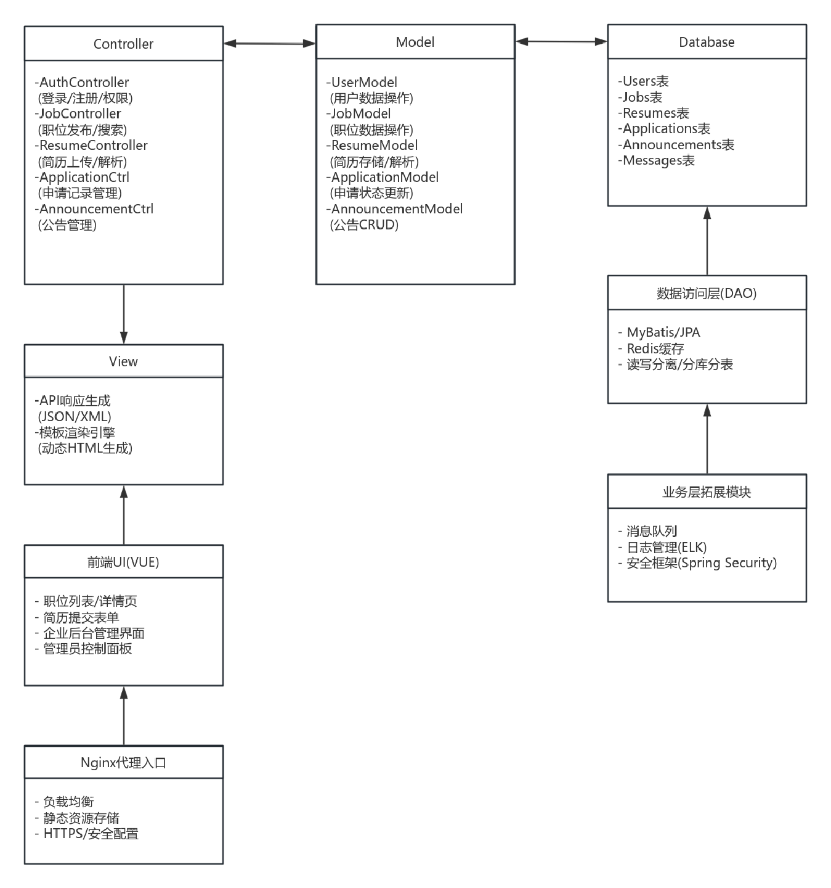

# Web应用架构报告
## 层次架构

该架构示意图主要分为：**入口层（Nginx 代理入口）→ 前端UI → 展示层（Vue）→ 业务层（Spring Boot）→ 数据层（数据访问）→ 数据库层（MySQL）→ 基础设施层**。下面对各部分进行详细描述。

---
### 1. Nginx 代理入口
- **功能与作用**
    - 作为系统的统一入口，对外提供域名访问。
    - 实现负载均衡，将请求分发到后端不同服务实例。
    - 提供静态资源的缓存与加速，例如缓存前端的 JS、CSS、图片等文件。
    - 提供安全保障，可以在此层做初步的安全防护配置（如限制访问IP、HTTPS配置等）。
- **应用**
    - 外部用户（学生、企业、管理员）通过域名访问系统，Nginx 将请求代理到后端 Spring Boot 服务或返回缓存的静态资源。
    - 减少后端服务器压力并提升整体响应速度。
### 2. 前端UI
- **功能与作用**
	- 为学生和企业提供友好的操作界面（如投递简历、查看职位详情、发布招聘信息等）；为管理员提供管理面板（如发布公告、审核职位、查看用户反馈等）。
    - 负责在浏览器端呈现系统的界面，包括登录、注册、职位列表、简历上传等页面。
    - 通过 HTML、CSS、JavaScript 等实现用户交互与视觉效果。
    - 存放静态资源，如项目 logo、图标、样式表、公共 JS 脚本等。
### 3. 展示层
- **功能与作用**
    - 基于 **Vue.js** 构建的单页应用（SPA），实现页面的动态渲染与前后端分离。
    - 通过 **Vue 路由** 控制页面跳转，简化前端路由管理。
    - 通过 **Fetch** 发起 **POST / GET** 请求，将用户操作传递给后端 API，并获取后端返回的数据，实时更新页面。
    - 提高用户体验：无需刷新整个页面即可切换内容，减少加载时间。
- **应用**
    - 学生端：查看职位、投递简历、查看投递结果、与企业沟通等功能的前端实现。
    - 企业端：发布招聘信息、管理职位、查看投递记录、与学生沟通等。
    - 管理员端：登录后台后可通过 Vue.js 管理公告、查看统计数据等。
    - 统一的前端项目通过不同的路由和组件来区分学生、企业、管理员的视图。
### 4. 业务层
- **功能与作用**
    - 核心业务逻辑的实现层，使用 **Spring Boot** 框架。
    - 处理来自前端的各种请求（如学生投递简历、企业审核简历、管理员发布公告等），并进行业务校验与流程控制。
    - 将业务操作与数据访问分离，便于维护和扩展。
#### 系统管理
1. 账户管理：处理学生、企业、管理员的注册登录、权限校验、信息更新等
2. 权限管理：为不同角色（学生、企业、管理员）分配对应的系统访问权限，如查看岗位信息、投递简历、审核企业等。
3. 菜单管理：根据角色或权限自动展示可访问的功能菜单。
4. 角色管理：预设学生、企业、管理员等角色，为用户分配一个或多个角色，进而继承角色所包含的权限。
#### 系统配置
1. 系统参数设置
- 基础参数：如职位类型（实习、全职、兼职等）、企业规模、学历要求等。
- 业务规则：配置最大投递次数、简历可见度设置、公告发布规则等。
- 全局设置：包括站点名称、Logo、上传文件大小限制、邮件服务器配置等。

1. 数据处理与统计
- 招聘数据统计：统计投递数量、录用率、不同专业或学历的投递分布等，为企业或管理员提供数据参考。
- 用户行为分析：统计学生访问岗位、投递频次、企业查看简历情况，帮助管理员或企业决策。
- 日志审计：整合各模块产生的日志数据，生成审计报表或图表。
    
1. 日志管理
- 操作日志：记录用户关键操作（登录、发布职位、删除公告等），便于安全审计和问题追踪。
- 错误日志：记录系统异常与错误信息，辅助开发运维人员排查问题。
- 查看与检索：提供后台界面或API查询功能，可按时间、用户、事件类型等过滤日志。
#### 内容管理
1. 聊天管理
- 企业与学生互动：提供职位咨询、面试沟通等即时或留言式交流；
- 消息推送：可将面试邀请、投递结果等信息推送给学生，或将补充信息需求推送给企业；
- 系统内私信/留言：支持学生对公告或职位进行留言，企业或管理员可回复。
    
2. 公告管理
- 公告发布：管理员在后台发布系统公告，如招聘会信息、节假日通知等；
- 公告类型：可区分系统公告、校园活动公告、企业宣讲公告等；
- 公告展示：学生与企业在前端可查看最新公告，支持置顶、定时发布、过期下架等功能。
    
3. 审批管理
- 职位审核：管理员或系统运营人员审核企业发布的职位信息，防止虚假或违规招聘信息；
- 企业审核：对新注册企业或信息变更（如企业名称、资质等）进行审核；
- 简历审核：若有特殊职位或学生简历需要人工审核，可在此模块进行统一管理。
    
4. 推荐管理
- 职位推荐：根据学生的专业、学历、投递记录等数据，智能推荐适合的岗位；
- 人才推荐：企业可查看系统推荐的候选人列表，提升招聘效率；
### 5. 数据层
- **功能与作用**
    - 负责与数据库进行交互（CRUD：创建、读取、更新、删除）。
    - 将业务层与数据库操作隔离，提供统一的数据访问接口（DAO）。
    - 可以在此层实现缓存、读写分离、分库分表等优化手段。
- **应用**
    - 学生表、企业表、管理员表：存储基本用户信息。
    - 职位表：存储岗位信息，包括岗位名称、薪资、地点等。
    - 简历表：存储学生简历信息，包括教育背景、工作经历等。
    - 申请记录表：存储职位投递、企业审核等过程性数据。
    - 公告表：存储系统公告的信息。
    - 留言表：存储用户与企业的留言互动或管理员的回复。
### 6. 数据库层
- **功能与作用**
    - 数据最终的持久化存储层，使用关系型数据库 MySQL。
    - 支持结构化查询（SQL），方便使用索引、事务等特性确保数据一致性和高效查询。
    - 存放所有与招聘流程相关的核心数据（用户信息、职位信息、投递记录、公告、留言等）。通过建表、索引、外键关系等保证数据完整性和查询性能。结合数据备份与容灾方案，确保系统高可用和数据安全。
### 7. 权限控制、日志记录等跨层功能
- **权限控制**
    - 可以在业务层或数据访问层实现基于角色的访问控制，保证只有授权用户才能访问或修改特定资源。在 Spring Boot 中用 Spring Security 等安全框架来实现。
- **日志记录**
    - 在业务层或网关层记录用户关键操作与系统错误日志，便于问题排查与审计。
    - 可以结合 ELK（Elasticsearch + Logstash + Kibana） 或其他日志分析平台做可视化监控。
- **其他中间件或第三方服务**
    - 比如消息队列（RabbitMQ/Kafka）处理异步任务；
    - 缓存中间件（Redis）加速热点数据访问；
    - 第三方存储（如云存储）用于简历附件或图片的上传与访问。
### 8. 整体运行流程简要
1. **用户访问**：浏览器向 Nginx 发起请求，Nginx 将静态资源（HTML/CSS/JS/图片）直接返回，或将 API 请求代理到后端 Spring Boot 服务。
2. **前端交互**：Vue.js 处理页面渲染和用户操作，通过Fetch调用后端 API。
3. **业务处理**：后端 Spring Boot 接收请求，根据业务逻辑（职位发布、简历投递、公告管理等）进行处理。
4. **数据存取**：后端通过数据访问层（DAO）操作 MySQL，完成对表记录的增删改查。
5. **返回结果**：后端将处理结果以 JSON 等格式返回给前端，Vue.js 动态更新界面；或在日志、消息队列、缓存等进行后续操作。
### 9. 总结
通过上述层次架构，**校园招聘系统**将前端与后端进行了解耦，前端使用 Vue.js 提高用户体验，后端使用 Spring Boot 进行业务处理，Nginx 作为网关和静态资源服务器，MySQL 提供数据持久化。该架构具有良好的可扩展性、可维护性和可靠性，适合于中小型在线招聘系统的搭建与后续演进。

## MVC架构
### 1.架构图设计

   
### 2.架构分层说明   
#### Controller层（控制层）
- **职责**：接收HTTP请求，解析参数，调用业务逻辑，返回响应。
- **核心模块**：
	- AuthController：处理用户认证、权限验证（基于Spring Security）。
	- JobController：职位发布、搜索、详情查询（支持模糊搜索和智能推荐）。
	- ResumeController：简历上传、解析（PDF/Word格式）、存储（OSS云存储）。
	- ApplicationController：申请记录管理（状态更新、撤回逻辑）。
	- AnnouncementController：公告发布、置顶、下架（定时任务支持）。
- **技术实现**：Spring Boot的@RestController，支持RESTful API设计。
#### Model层（模型层）
- **职责**：定义数据结构，封装数据库操作和业务逻辑。
- **核心模块**：
	- **数据模型**：User、Job、Resume、Application等，对应数据库表结构。
	- **业务逻辑**：
		- 职位审核逻辑（管理员审核企业发布的职位）。
		- 简历匹配算法（根据职位要求智能推荐简历）。
		- 申请状态机（投递→审核→面试→Offer）。
- **技术实现**：JPA/Hibernate实现ORM，Redis缓存热点数据（如职位列表）。
#### View层（视图层）
- **职责**：生成最终响应内容，支持前端渲染和服务端渲染。
- **核心模块**：
	- API响应生成：返回JSON/XML格式数据（用于Vue.js前端）。
	- 模板渲染引擎：Thymeleaf生成动态HTML（管理员后台页面）。
- **技术实现**：Vue.js单页应用（SPA），Axios处理API请求。
#### 数据访问层（DAO）
- **职责**：封装数据库操作，支持读写分离和分库分表。
- **技术实现**：MyBatis动态SQL，结合Sharding-JDBC分片。
#### 基础设施层
- **Nginx**：负载均衡、静态资源缓存、HTTPS配置。
- **消息队列**：RabbitMQ处理异步任务（如邮件通知、简历解析）。
- **日志管理**：ELK（Elasticsearch + Logstash + Kibana）实现日志收集与分析。
- **安全框架**：Spring Security实现角色权限控制（RBAC）。

### 3.交互流程示例
- **学生投递简历**
- 步骤：
	- 学生通过Vue前端提交简历表单。
	- Nginx将请求路由到ResumeController。
	- ResumeController调用ResumeModel解析简历文件并存储元数据。
	- ApplicationModel创建申请记录，校验职位是否开放。
	- 通过RabbitMQ异步发送邮件通知企业。
	- 返回JSON响应{"status": "success", "message": "简历已投递"}。
- **企业发布职位**
- 步骤：
	- 企业填写职位信息并提交。
	- JobController调用JobModel保存职位数据，状态设为“待审核”。
	- 管理员后台审核通过后，状态更新为“招聘中”。
	- Redis缓存热门职位列表，提升查询性能。

### 4.技术选型与扩展性
| 组件 | 技术选型 | 扩展性设计 |
|:---------:|:------------:|:----------------:|
| 前端框架 | Vue.js + Element UI | 模块化组件设计，支持动态路由加载。 |
| 后端框架 | Spring Boot 3.0 | 微服务化拆分（未来可扩展为职位服务、简历服务）。|
| 数据库 | MySQL + Redis | 分库分表策略（按用户ID哈希分片）。|
| 消息队列 | RabbitMQ | 支持优先级队列（紧急任务优先处理）。|
| 安全框架 | Spring Security + JWT | 多因素认证（未来支持短信/邮箱验证）。|
| 日志管理 | ELK Stack | 自定义日志分类（操作日志、错误日志、性能日志）。|

### 5.非功能需求实现
- **高并发支持**：
  	- Nginx负载均衡 + Redis缓存高频数据（如职位列表）。
	- 数据库读写分离，主库处理写操作，从库处理读操作。
- **安全性**：
	- HTTPS加密通信（Nginx配置SSL证书）。
	- 敏感数据（如密码）使用BCrypt加密存储。
	-  防止SQL注入（MyBatis参数化查询）。
- **可维护性**：
	- 代码模块化：按功能划分包结构（如com.campus.recruitment.controller）。
 	- API文档：Swagger生成接口文档，支持在线测试。
  	- 自动化部署：Jenkins + Docker实现CI/CD。

#### 6.数据库映射关系
| Model类 | 数据库表 | 关键字段映射 |
|:-----------:|:-----------:|:-----------:|
| UserModel | users | id ↔ user_id, username ↔ username |
| JobModel | jobs | id ↔ job_id, title ↔ job_title |
| ResumeModel | resumes | file_path ↔ resume_path |
| ApplicationModel | applications | status ↔ application_status |

#### 7.总结
本架构通过MVC分层实现了职责分离，同时整合了高并发、安全性、可维护性等非功能需求。未来可通过微服务化进一步扩展系统能力（如独立简历解析服务、智能推荐引擎），满足更大规模的校园招聘需求。
