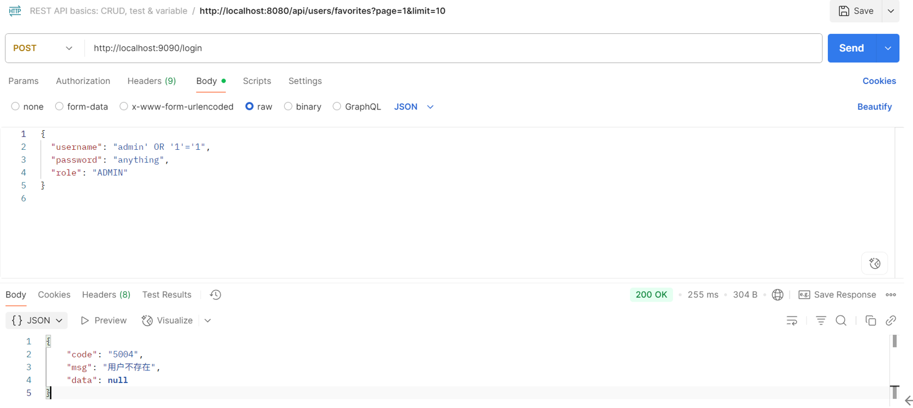

# 一、功能测试
Postman接口测试
- 通过Postman发起用户信息查询API请求，验证接口连通性及基础功能。
- Postman界面展示请求参数配置（如URL、Headers、Body）及成功响应结果（状态码200，返回预期JSON数据）。

# 二、安全性测试
SQL注入防护测试
- 使用经典Payload `' OR '1'='1` 模拟SQL注入攻击。
- 测试结果：Spring Boot框架内置防护机制生效，拦截恶意输入并返回安全错误响应。

# 三、单元测试
- 测试目的 ：在代码级别验证 Service、DAO 等组件的核心业务逻辑，及时捕捉空指针、边界条件及算法缺陷。
- 测试框架 ：采用 JUnit对每一个关键方法编写独立的测试用例，覆盖正常流、异常流和边界值。

# 四、性能测试
- 测试需求：测试20个用户访问网站在负载达到30QPS时的平均响应时间
QPS：Query Per Second 每秒查询率。（一台查询服务器每秒能够处理的查询次数，作为域名服务器的性能经常用每秒查询率来衡量）

测试步骤
1、添加线程组（线程数+准备时长+循环次数）
- 线程数：虚拟用户数，一个虚拟用户占用一个进程或线程（设置多少个虚拟用户=设置多少个线程）
- 准备时长（s）：设置的虚拟用户数需要多长时间全部启动。eg：线程数为20，准备时长为10，则说明需要10秒钟启动20个进程。
- 循环次数：每个线程发送请求的次数。eg：线程数为20，循环次数为5，那么每个线程发送5次请求，总请求数为20\*5=100

测试结果：系统在高负载下表现优异，吞吐量稳定达到10.4请求/秒，核心响应指标全部达标：异常率为0%，且99%的请求响应时间不超过14ms，完全满足30QPS的性能需求。

# 五、WebUI测试
通过Selenium脚本模拟用户端操作。脚本代码定位页面元素（输入框、按钮），执行登录/表单提交操作。
所有核心流程在两种主流浏览器中均能顺利执行，无定位失败或断言错误。

